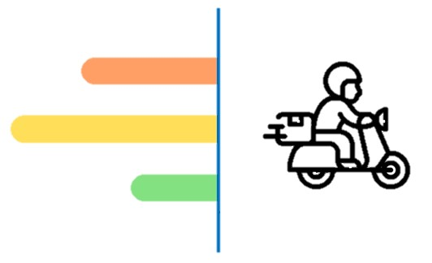

Heading
# 큰글씨
## 큰글씨2 
### 큰글씨3
#### 큰글씨4

---
Bold

**bold text**

---
italic

*italic*

1. First
2. Second
3. Third

- First
- Second
- Third
    - First
    - Second
    - Third
        - first

---
``` 
code block
```

[네이버로](https://www.naver.com)



| 테이블1 | 설명1|
| ------  | ------ |
| 제목1   | 제목1|
| 설명2|설명2|


:joy:

[치트시트](https://www.markdownguide.org/cheat-sheet)
